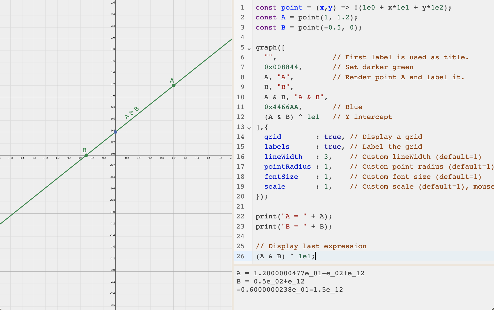

# GA Playground

A simplifed alternative to the excellent [coffeeshop](https://github.com/enkimute/ganja.js) which attempts to make the scripting experience less weird. The entire script is translated instead of the individual function source, meaning we don't have eval issues that rely on the `window` object to access variables outside the function scope and we have consistent behaviour between runs.

This is intended as a toy for helping get my head around [Geometric Algebra](https://bivector.net).



Some nice features:

* The value of the last expression is displayed in the output console by inserting a return statement.
* The script is re-evaluated automatically and progress is saved to your local browser cache incase the page accidentally reloads
* Can use the `print` and `graph` functions to output multiple messages to the console and show multiple graphs respectively.

Use `context_manager.pushAlgebra(...)` and `context_manager.popAlgebra()` to change the currently active Algebra 'mode'. They take the same arguments as the `Algebra` factory from `ganja.js` but there might be some support holes. The default is 2D PGA, equivilent to `Algebra(2, 0, 1)`. The current algebra object is accessiable via `context_manager.getAlgebra()` but direct access is probably not needed. This helps with the scoping and consistancy issues stated above but also helps with interoperability by ensuring each algebra produced by the factory is a singleton. This all probably comes at a slight performance cost that I am yet to care about.

Known issues:

* A lock situation occurs if you manage to save the current script to cache and it contains an infinate loop, hence the locking script will be run even on page refresh. The solution is to clear the browser cache. Hopefully this is hard to do.

## Requirements

Make sure to use `git clone --recursive` as there are submodules.

1. [Nodejs](https://nodejs.org/en/) runtime.
2. Yarn package manager, install with `npm install -g yarn`.

## Develop

1. Install dependancies.

```
yarn install
```

2. Start development server.

```
yarn start
```

Entry point is `src/main.html`.
Attach the debugger from the 'Run and Debug' panel if in VS Code.

## Other commands

* `yarn build` Builds are output to `dist/`.
* `yarn fmt` Makes sure files in `src/` meet some javascript formatting rules.